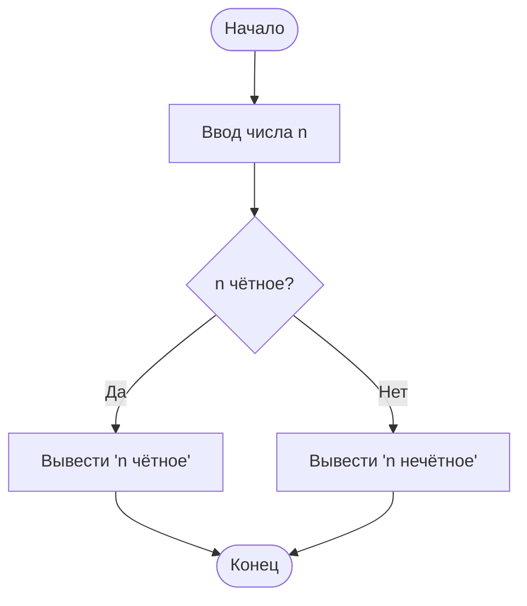

МИНИСТЕРСТВО НАУКИ И ВЫСШЕГО ОБРАЗОВАНИЯ РОССИЙСКОЙ ФЕДЕРАЦИИ

ФЕДЕРАЛЬНОЕ ГОСУДАРСТВЕННОЕ БЮДЖЕТНОЕ ОБРАЗОВАТЕЛЬНОЕ УЧРЕЖДЕНИЕ
ВЫСШЕГО ОБРАЗОВАНИЯ
«УФИМСКИЙ УНИВЕРСИТЕТ НАУКИ И ТЕХНОЛОГИЙ»

Кафедра автоматизированных систем управления

 
 
 

ОТЧЕТ

по лабораторной работе № 2

по дисциплине «Основы современных цифровых технологий и искусственного интеллекта»

на тему: «Markdown»

 
 
 
 
 

Выполнил: студент гр. ИВТ-ИСУ-103Б Лищенко А.И. 
Проверил: профессор каф. АСУ Арьков В.Ю.

 
 
 
 
 

Уфа – 2025

##1.   Алгоритм
Программирование начинается с алгоритма. Простыми словами, ал
горитм — это последовательность шагов по решению какой-то
задачи или по достижению какой-то поставленной цели. Но согласно статье из Википедии:

> Алгори́тм (лат. algorithmi — от имени среднеазиатского математика Аль-Хорезми[1]) — совокупность точно заданных правил решения некоторого класса задач или набор инструкций, описывающих порядок действий исполнителя для решения определённой задачи.Понятие алгоритма относится к первоначальным, основным, базисным понятиям математики. Вычислительные процессы алгоритмического характера (арифметические действия над целыми числами, нахождение наибольшего общего делителя двух чисел и т. д.) известны человечеству с глубокой древности. Однако в явном виде понятие алгоритма сформировалось лишь в начале XX века.

> Частичная формализация понятия алгоритма началась с попыток решения проблемы разрешения (нем. Entscheidungsproblem), которую сформулировал Давид Гильберт в 1928 году. Следующие этапы формализации были необходимы для определения эффективных вычислений[2] или «эффективного метода»[3]; среди таких формализаций — рекурсивные функции Геделя — Эрбрана — Клини 1930, 1934 и 1935 гг., λ-исчисление Алонзо Чёрча 1936 г., «Формулировка 1» Эмиля Поста 1936 года и машина Тьюринга.

> Разнообразные теоретические проблемы математики и ускорение развития физики и техники поставили на повестку дня точное определение понятия алгоритма.
Первые попытки уточнения понятия алгоритма и его исследования осуществляли в первой половине XX века Алан Тьюринг, Эмиль Пост, Жак Эрбран, Курт Гедель, А. А. Марков, Алонзо Чёрч. Было разработано несколько определений понятия алгоритма, но впоследствии было выяснено, что все они определяют одно и то же понятие (см. Тезис Чёрча — Тьюринга)[6]
Российский математик, основоположник структурной лингвистики в Советском Союзе В. А. Успенский считал, что понятие алгоритма впервые появилось у Эмиля Бореля в 1912 году, в статье об определённом интеграле. Там он написал о «вычислениях, которые можно реально осуществить», подчеркивая при этом: «Я намеренно оставляю в стороне большую или меньшую практическую деятельность; суть здесь та, что каждая из этих операций осуществима в конечное время при помощи достоверного и недвусмысленного метода»[7].

## 2. Блок-схема или схема алгоритма

## Задание 

Просмотрите статью Блок-схема на Википедии. Об
ратите внимание на стандартные обозначения блоков на этой
схеме.

Блок-схема — распространённый тип схем (графических моделей), описывающих алгоритмы или процессы, в которых отдельные шаги изображаются в виде блоков различной формы, соединённых между собой линиями, указывающими направление последовательности.

При начертании элементов рекомендуется придерживаться строгих размеров, определяемых двумя значениями a и b. Значение a выбирается из ряда 15, 20, 25.. мм, b рассчитывается из соотношения 2⋅a = 3⋅b. Определение размеров несёт рекомендательный характер, однако, при соблюдении выполнения размеров блок-схемы имеют более аккуратный вид.

### Основные элементы блок-схем

#### Действие

#### Данные (ввод-вывод)

#### Предопределённый процесс (функция)

#### Вопрос (условие или решение)

#### Ограничитель

#### Цикл

#### Соединитель

#### Комментарий

#### Параллельные действия

## Задание

Выясните с помощью любого интеллектуального
помощника, когда «блок-схемы алгоритмов» стали называть
«схемы алгоритмов» и почему.

Согласно ответу DeepSeek:

Короткий ответ: **Официальный переход с термина «блок-схема» на «схема алгоритма» произошел в СССР в 1970 году с введением Государственного стандарта ГОСТ 19.701-70 (позже замененного на ГОСТ 19.701-90 и ныне действующий ГОСТ 19.701-2009)**.

### Подробнее о причинах и хронологии:

**1. До стандартизации (1950-е — 1960-е годы):**
*   Термин **«блок-схема»** (от англ. *block diagram* или *flowchart*) был основным и повсеместно использовался. Он интуитивно понятен: алгоритм изображается в виде соединенных между собой блоков (прямоугольников, ромбов и т.д.).
*   Этот термин пришел вместе с самой методикой графического описания алгоритмов из западной научной и инженерной литературы.

**2. Причина изменения (конец 1960-х — 1970 год):**
*   В СССР велась активная работа по созданию **Единой системы программной документации (ЕСПД)** — комплекса государственных стандартов, регламентирующих разработку программного обеспечения.
*   Целью было упорядочивание хаоса в документации, обеспечение единообразия и строгости, что особенно важно для оборонной и космической отраслей.
*   **Разработчики стандартов пошли по пути терминологической точности и системности.** Они решили, что:
    *   **«Схема»** — это более общее и строгое понятие (как электрическая схема, кинематическая схема).
    *   Определяющим элементом является не «блок» (это просто графический элемент), а суть документа — **алгоритм**.
    *   Поэтому правильнее и логичнее называть документ **«Схема алгоритма»**, где «алгоритм» — объект описания, а «схема» — способ его представления.
    *   Термин «блок-схема» был признан жаргонным, хотя и очень живучим.

**3. Результат и наследие:**
*   **ГОСТ 19.701-70** закрепил термин **«Схема алгоритма»** как официальный. Все последующие версии стандарта (1990, 2009 гг.) сохранили это название.
*   В профессиональной среде, особенно в официальной документации, учебниках, технических заданиях по госзаказу, используется **исключительно «схема алгоритма»**.
*   Однако в неформальном общении, в старой литературе, в интернет-среде и даже в некоторых современных западнизированных курсах термин **«блок-схема»** остался крайне распространенным. Он является своего рода **профессиональным архаизмом или разговорным синонимом**.

### Почему «схема алгоритма» — более точный термин?
1.  **Системность:** В ЕСПД есть также «схема данных», «схема взаимодействия программ». Название «схема алгоритма» встраивается в эту систему.
2.  **Акцент на сути:** Первичен алгоритм (процесс), а не блоки (форма).
3.  **Избегание двусмысленности:** «Блок-схемой» в других областях (например, в теории систем) могут называть структурную диаграмму высокого уровня, показывающую состав системы (блоки и связи между ними), но не последовательность операций.

**Вывод:** **«Схема алгоритма»** — это официальный, стандартизированный термин, введенный в СССР в 1970 году для придания строгости программной документации. **«Блок-схема»** — это устоявшийся разговорный и исторический термин, который продолжает активно использоваться по сей день по привычке и благодаря своей наглядности.

## Задание
Найдите в интернете отечественный стандарт
по рисованию схемы алгоритма. Номер и название стандарта
можно найти в конце статьи про блок-схему из предыдущего задания. Просмотрите текст стандарта и обратите внимание на примеры оформления схем в конце текста.

Нас интересует
**ГОСТ 19.701-90 (ЕСКД)**

**Официальное название:** Схемы алгоритмов, программ, данных и систем. Условные обозначения и правила выполнения.

**Основная суть:**
Стандарт устанавливает правила оформления и условные графические обозначения для создания схем алгоритмов и программ (блок-схем) в документации на вычислительную технику и программное обеспечение.

**Ключевые моменты:**

1.  Определяет набор стандартных фигур (блоков) для отображения различных элементов алгоритма:
    *   **Процесс** (прямоугольник) — выполнение операции или группы операций.
    *   **Решение** (ромб) — точка ветвления алгоритма.
    *   **Модификация** (шестиугольник) — начало цикла.
    *   **Предопределенный процесс** (прямоугольник с двойными вертикалями) — вызов подпрограммы или стандартного модуля.
    *   **Данные (ввод-вывод)** (параллелограмм) — операция ввода или вывода информации.
    *   **Терминатор** (скругленный прямоугольник) — начало или конец алгоритма.
    *   **Соединитель** (круг) и **Линия** — для связи блоков и указания потока выполнения.

2.  Описывает, как правильно располагать блоки, соединять их линиями потока, нумеровать и подписывать. Устанавливает требования к оформлению документа.

3.  Стандарт предназначен для разработчиков, программистов и технических писателей при создании документации в соответствии с Единой системой программной документации (ЕСПД).

## Задание
Выясните с помощью интеллектуального помощника, что такое Workflow Diagram и есть ли здесь какая-то связь со схемой алгоритма Flowchart.

Согласно ответу DeepSeek:

Отличный вопрос, который затрагивает суть визуализации процессов.

**Workflow Diagram (Диаграмма рабочего процесса / бизнес-процесса)** — это схема, которая визуализирует последовательность действий, задач, информации и участников в рамках **бизнес-процесса**. Её главная цель — показать, *как работа выполняется* в организации, кто за что отвечает и как данные переходят от одного этапа или сотрудника к другому.

---

### Ключевые черты Workflow Diagram:
*   **Фокус:** Бизнес-процессы, ручные и автоматизированные задачи, взаимодействие людей и отделов.
*   **Элементы:** Действия, исполнители (роли: "Менеджер", "Бухгалтерия", "Склад"), документы, решения, точки передачи.
*   **Язык:** Часто использует элементы BPMN (Business Process Model and Notation) — это современный и богатый стандарт. Например, есть специальные символы для сообщений, событий, таймеров, пулов и "дорожек" (swimlanes), которые четко разделяют зоны ответственности.
*   **Цель:** Оптимизация, стандартизация, автоматизация и понимание бизнес-процесса.

---

### Связь и различия со схемой алгоритма (Flowchart)

**Да, связь есть, и она прямая.** Можно сказать, что **Flowchart** (к которому относится ГОСТ 19.701-90) — это более общая, фундаментальная концепция, а **Workflow Diagram** — её специализированная разновидность, адаптированная для бизнес-среды.

#### Сходства:
1.  **Оба описывают последовательность шагов** от начала до конца.
2.  **Используют логику потока:** ветвления (решения), циклы, старт и стоп.
3.  ️**Цель — наглядность и понимание** процесса.

#### Ключевые различия:

| Аспект | **Flowchart (ГОСТ 19.701-90, блок-схема алгоритма)** | **Workflow Diagram (Диаграмма рабочего процесса)** |
| :--- | :--- | :--- |
| **Сфера применения** | **Программирование, математика, алгоритмы.** | **Бизнес-администрирование, управление процессами.** |
| **Что описывает** | **Логику программы или вычислительного алгоритма.** Как компьютер обрабатывает данные. | **Порядок работы людей и систем в организации.** Как выполняется бизнес-задача. |
| **Основные элементы** | Процесс, решение, ввод/вывод, терминатор (по ГОСТу). | Задача, исполнитель (роль), документ, событие, "дорожки" (часто по BPMN). |
| **"Герой" процесса** | **Данные** и их преобразование. | **Задача/работа** и её переход между исполнителями. |
| **Уровень детализации** | Часто очень детальный, до уровня операций. | Может быть как общим (макропроцесс), так и детальным, но всегда в контексте бизнеса. |
| **Стандарт** | ГОСТ 19.701-90, ISO 5807. | Чаще **BPMN 2.0**, иногда расширенные нотации. |

---

### Наглядная аналогия

*   **Flowchart (блок-схема по ГОСТ)** — это **"рецепт для повара-робота"**. Он точен: "Возьми 100 г муки, проверь, если яйца, добавь, замеси, выпекай при 180°C 30 минут". Это инструкция для выполнения без участия мысли.
*   **Workflow Diagram** — это **"схема работы ресторана"**. Она показывает: "Клиент делает заказ официанту, официант передает заказ на кухню, шеф-повар распределяет задачи между поварами, готовое блюдо передается официанту, который несет его клиенту". Здесь важны роли, взаимодействия и передача объектов (заказ, блюдо).

### Вывод

**Flowchart (по ГОСТ 19.701-90)** — это **прародитель и технический инструмент**, идеально подходящий для описания алгоритмов, особенно в программировании.

**Workflow Diagram** — это его **бизнес-ориентированный "внук"**, который унаследовал логику потока, но добавил абстракции для людей, ролей, организационных единиц и документов.

**Связь:** Workflow Diagram можно считать прикладным, высокоуровневым случаем использования принципов flowchart в контексте бизнес-процессов. Если очень упростить, то Workflow — это Flowchart, наложенный на организационную структуру компании.

Итак, если говорить коротко:

Workflow Diagram  — это схема, которая визуализирует последовательность действий, задач, информации и участников в рамках бизнес-процесса. Её главная цель — показать, как работа выполняется в организации, кто за что отвечает и как данные переходят от одного этапа или сотрудника к другому.
Можно сказать, что Flowchart — это более общая, фундаментальная концепция, а Workflow Diagram — её специализированная разновидность под бизнес-среду.

## 3. DRAW.IO

## Задание
Выясните, что означает английское слово
Terminator (Терминатор), его происхождение, и какое отношение
всё это имеет к рисованию схемы алгоритма и к фильмам с участием Шварценеггера.

#### 1. Значение и происхождение слова

Слово «Terminator» происходит от латинского **«terminare»** — «ограничивать, завершать, положить предел». Английское слово **«terminate»** означает «прекращать, завершать».

В общем смысле «Terminator» — это тот, кто или то, что завершает, прекращает что-либо.

В схеме алгоритма «Терминатор» — это специальный символ (скругленный прямоугольник или овал), который обозначает начало или конец алгоритма, а также точку входа/выхода в подпрограмму.

#### 2. Отношение к фильмам с Шварценеггером

*   Робота из фильма «Терминатор» назвали так именно потому, что его главная и единственная миссия — завершить («terminate») жизнь Сары Коннор. Он не ведёт переговоров, не отступает — его функция — полное и окончательное прекращение её существования. Он — воплощение понятия «завершитель».
*   Он без эмоций, как строгий символ в схеме: получил цель (начало алгоритма) -> выполняет процесс (поиск и устранение) -> достигает цели (конец алгоритма). Его логика проста, как блок-схема.

## Задание
Запустите сервис Draw.io и постройте простой алгоритм из трёх блоков, как показано на рисунке. Сохраните схему в файле на локальном компьютере.

## Задание
Сохраните вашу диаграмму во всех четырёх форматах. Ознакомьтесь с содержимым файлов. Изучите, как эти
файлы отображаются на экране при просмотре. Проверьте, как
меняется качество изображения при увеличении.

* .svg - отображается через браузер как XML-графика, без потерь качества при увеличении - линии остаются чёткими
* .html - отображается в браузере как веб-страница, при увеличении отображается отлично - полная интерактивность и масштабирование
* .png - пикселизация при >100% масштаба
* .drawio - отображается только в самом draw.io - содержит всю структуру

## Задание
Разберитесь, как вставить эти изображения в документы типа DOCX и MD.

## 4.MERMAID
Новый, модный, популярный подход к рисованию схем называется Diagram as Code — «Диаграмма как код».Это рисование с помощью текста, текстового описания.Один из примеров бесплатных, популярных онлайн сервисов для создания диаграмм такого рода — это Mermaid. 

## Задание
Сохраните свою диаграмму в разных форматах
и изучите качество изображения.
* .svg - преимущества: абсолютная маштабируемость, небольшой вес файла, редактируемость и стилизация, интеграция в веб; недостатки: поддерживают не все системы
* .png - преимущества: универсальная совместимость, простая вставка; недостатки: пикселизация при увеличении, больший размер файла, не редактируется

## Задание
Скопируйте схему в буфер и вставьте её в текстовый редактор типа Word и в графический редактор типа Paint.
Сделайте вывод о том, в каком формате наше изображение копируется в буфер.

Так как вставилось не как редактируемая векторная графика - png.

Для Paint вставляется в формате png.

Cсылки, чтобы поделиться схемой онлайн:
* https://mermaid.ink/img/pako:eNo9kE1KxEAQha8SauVAJiTp_PZC0HHrBZxk0Ux3fiBJD20Hf4aAK72D4MIbZGFAEOcMlRvZE9Fa1fuo9wreAXaSC6BQNPJuVzGlrayzzFycbfENx_kFR_zCY76y1utz63KL7zjNTzjhB37iN475wjfm-hWPBkzzc74CG0pVc6Ba9cKGVqiWnSQcTuEZ6Eq0IgNqVi4K1jc6g6wbjG3Puhsp2z-nkn1ZAS1Yc2tUv-dMi6ualYq1_1SJjgu1kX2ngZLIX0KAHuDeSI84PnGTNPW9mJAwITY8APViJ_KDNEr92AvDOHCDwYbH5a_rJHFog-C1lur6t5ulouEH_WdqFQ?type=png
* https://mermaid.ink/svg/pako:eNo9kE1KxEAQha8SauVAJiTp_PZC0HHrBZxk0Ux3fiBJD20Hf4aAK72D4MIbZGFAEOcMlRvZE9Fa1fuo9wreAXaSC6BQNPJuVzGlrayzzFycbfENx_kFR_zCY76y1utz63KL7zjNTzjhB37iN475wjfm-hWPBkzzc74CG0pVc6Ba9cKGVqiWnSQcTuEZ6Eq0IgNqVi4K1jc6g6wbjG3Puhsp2z-nkn1ZAS1Yc2tUv-dMi6ualYq1_1SJjgu1kX2ngZLIX0KAHuDeSI84PnGTNPW9mJAwITY8APViJ_KDNEr92AvDOHCDwYbH5a_rJHFog-C1lur6t5ulouEH_WdqFQ

## Задание
Скопируйте диаграмму в буфер обмена в формате
Markdown и вставьте её в текстовую ячейку Google Colab. Затем
запустите текстовую ячейку на выполнение и перейдите
по ссылке, щёлкнув мышкой по диаграмме. Откроется страница
редактирования. Внесите небольшое изменение в диаграмму.
Скопируйте ссылку на код Markdown и вставьте его в эту же текстовую ячейку. Обратите внимание на изменение текстовой
строки

## 5. MERMAID + GITHUB
## Задание
Создайте в своём репозитории на GitHub новый файл с расширением MD и вставьте в него свою схему. Убедитесь, что схема отображается корректно. Скопируйте свою схему
в буфер обмена и вставьте её в текстовый и графический редактор. Сделайте вывод о том, в каком формате копируется изображение

КАРТИНКА

## Задание 
Постройте более сложную схему алгоритма, в которой будут условный переход и вывод на печать. Вставьте схему в свою страничку на github.

## 6. MERMAID + COLAB

## Задание 
 Ознакомьтесь со следующими инструментами
и технологиями. Можете использовать Википедию и интеллектуальный чат-бот либо просто поиск в интернет.
base64, IPython, Jupyter Notebook, Pyplot, Matplotlib, UTF-8,
URL, ASCII, параметры и аргументы функции, string, multiline
string.

Ниже краткие объяснения по каждому термину и как они связаны между собой в программировании и работе с данными.

## Кодировки и текст

- **ASCII** — ранний стандарт кодировки, использующий 7 бит на символ и поддерживающий базовый латинский алфавит, цифры и некоторые знаки; всего 128 символов.
- **UTF‑8** — современная кодировка Unicode с переменной длиной от 1 до 4 байт на символ, полностью совместима с ASCII для первых 128 кодов и поддерживающая символы большинства языков мира.
- **string (строка)** — последовательность символов; в Python строка хранит текст в Unicode, обычно в UTF‑8 при записи в файлы и пересылке по сети.[2]
- **multiline string (многострочная строка)** — строковый литерал, который может содержать перевод строки и оформляется специальным синтаксисом (например, в Python тройные кавычки), что удобно для хранения длинных текстов и форматированных сообщений.

## Передача и представление данных

- **URL (Uniform Resource Locator)** — текстовая строка, описывающая расположение ресурса в сети (схема, домен, путь, параметры запроса); в ней запрещённые символы кодируются в виде процентов и байтов, как правило, в UTF‑8.
- **Base64** — схема кодирования «бинарное‑в‑текст»: переводит произвольные байты (файлы, бинарные протоколы) в строку из 64 печатных символов (A–Z, a–z, 0–9, «+», «/» и «=» для выравнивания), чтобы безопасно передавать их в текстовых форматах (JSON, e‑mail, URL‑совместимые варианты).

## Параметры и аргументы функций

- **Параметры функции** — имена внутри объявления функции, которые описывают, какие значения она ожидает (формальные параметры).
- **Аргументы функции** — реальные значения, которые передаются функции при вызове и подставляются на место параметров (позиционные, именованные, по умолчанию и др.).

## IPython и Jupyter Notebook

- **IPython** — интерактивная оболочка для Python, расширяющая стандартный REPL поддержкой удобных команд, истории, авто‑дополнения и «магических» команд для работы с файловой системой, профилирования кода и интеграции с выводом графиков.
- **Jupyter Notebook** — среда, в которой код (часто на Python), текстовые пояснения и результаты (включая графики и таблицы) объединяются в «ноутбук» из ячеек, удобный для обучения, исследований и анализа данных.

## Matplotlib и Pyplot

- **Matplotlib** — популярная библиотека визуализации данных на Python, позволяющая строить линейные, столбчатые, точечные графики и многое другое; широко используется в научных вычислениях и аналитике.
- **Pyplot (модуль matplotlib.pyplot)** — подмодуль Matplotlib с процедурным интерфейсом «как в MATLAB», в котором графики создаются последовательными вызовами `plt.plot`, `plt.xlabel`, `plt.show` и т.п.; особенно удобен в Jupyter Notebook.

## Задание
Сформируйте ссылку для вывода вашей диаграммы и скопируйте её в буфер. Используя эту ссылку, напишите код для текстовой ячейки. Убедитесь, что диаграмма корректно отображается на экране.

